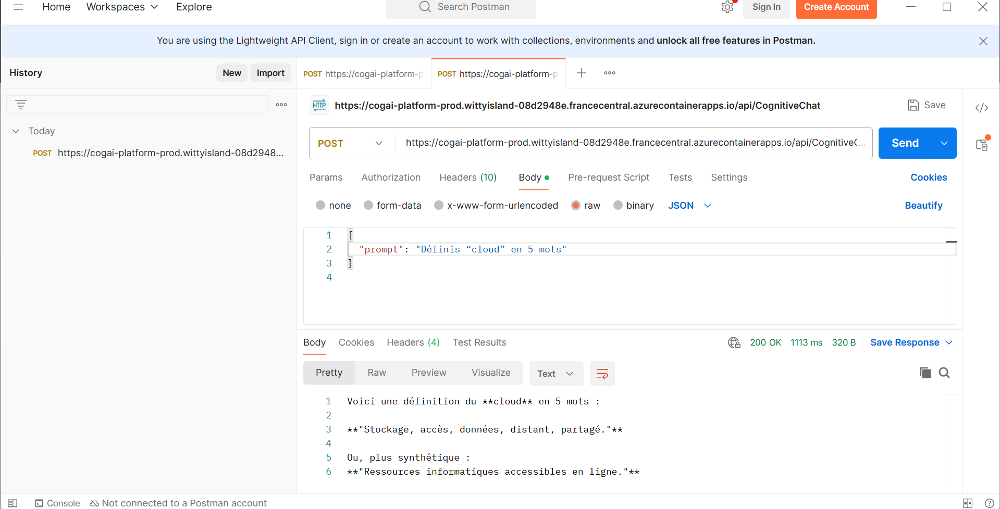
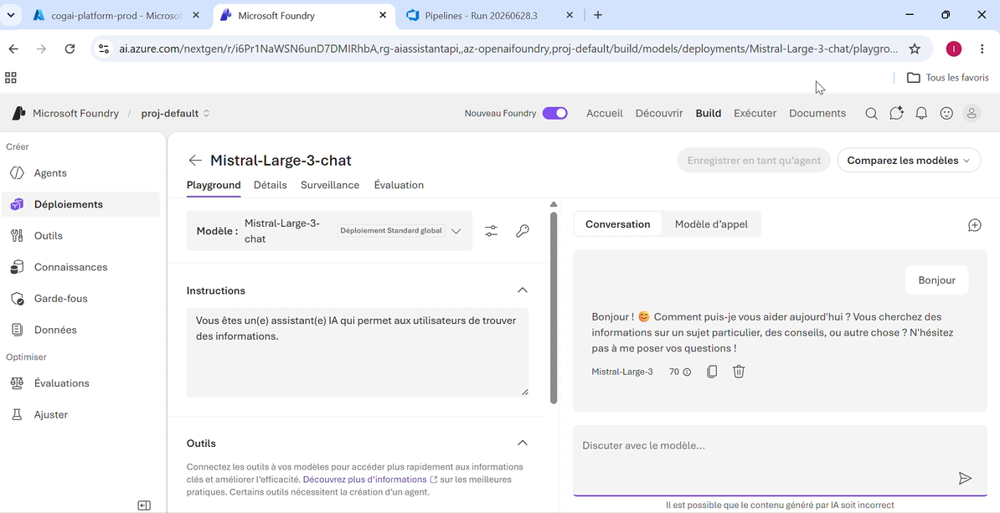
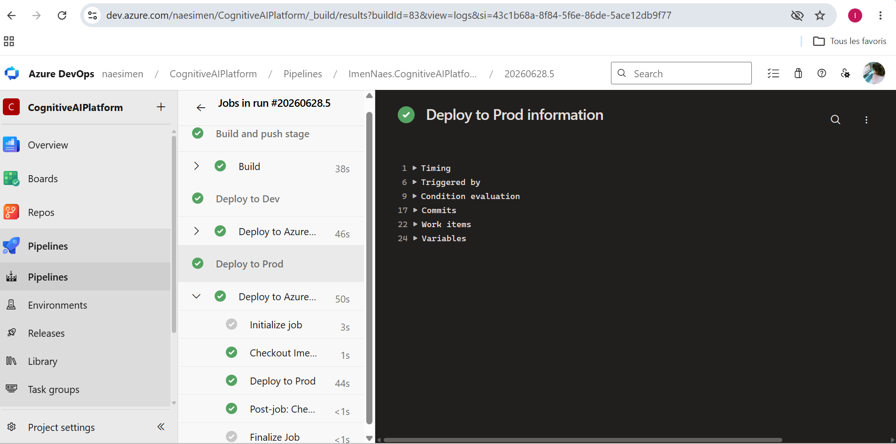
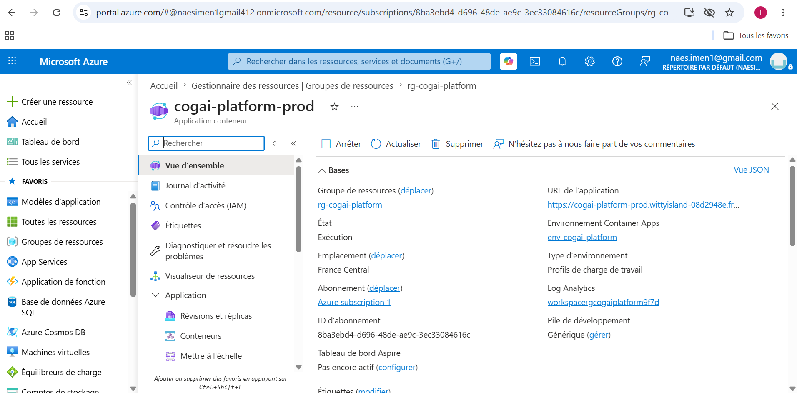
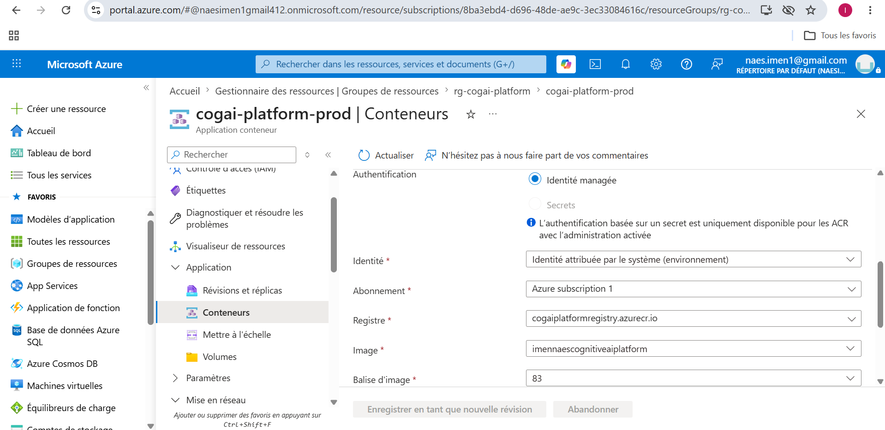
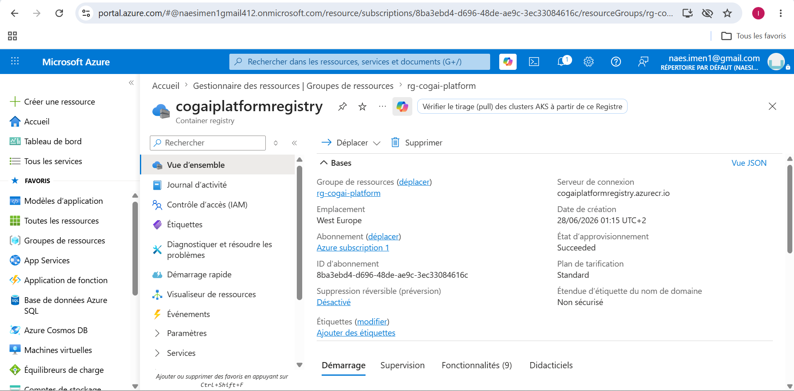
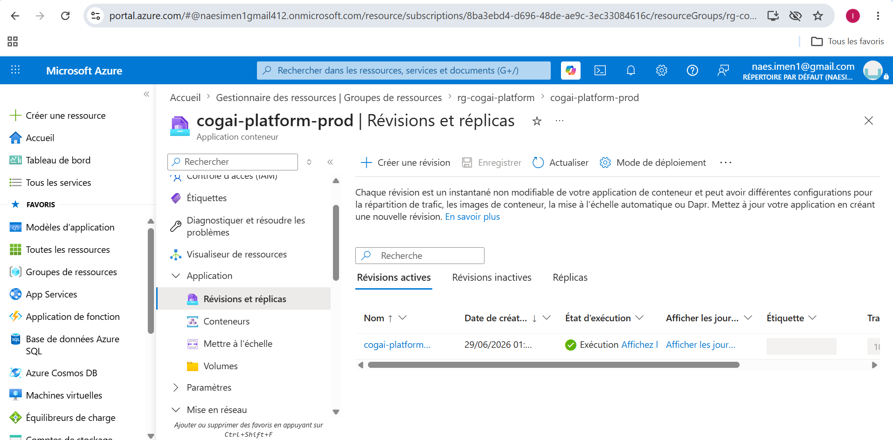
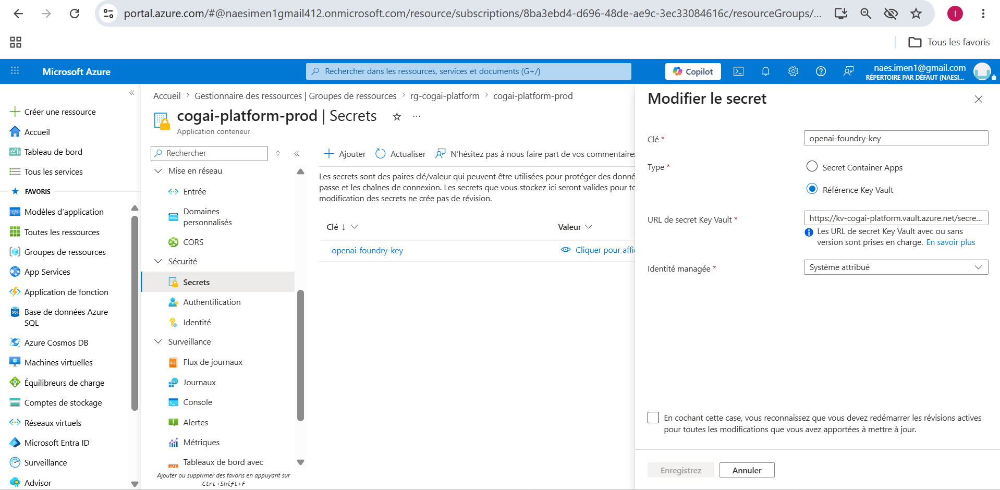
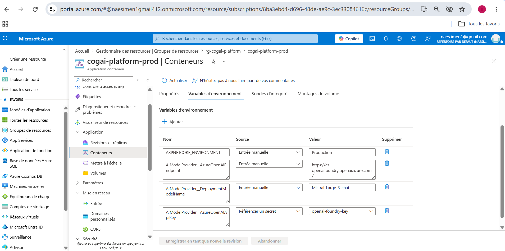

## API Interne – .NET 10 – Azure Container Apps - Azure AI Factory - CI/CD DevOps

Une API interne permettant d’interroger un modèle Mistral_Large-3 déployé via Azure AI Factory. L’API reçoit un paramètre prompt et renvoie une réponse générée par le modèle.

L’application est :

- développée en .NET 10

- conteneurisée via Docker

- déployée automatiquement via Azure DevOps (CI/CD)

- hébergée sur Azure Container Apps

- intégrée avec Azure AI Model Factory pour l’inférence LLM

 1. Architecture globale
    
Cette architecture illustre le fonctionnement complet du système :

- API interne en .NET

- Container Docker

- Azure Container Registry

- Azure Container Apps

- Azure AI Model Factory (Mistral-Large-3)

- Pipeline CI/CD Azure DevOps

 2. Fonctionnement de l’API :
    
http

POST /api/CognitiveChat

Content-Type: application/json

Exemple de requête

json
{
      "prompt": "Explique-moi la différence entre IA faible et IA forte."
}

Exemple de réponse

json
{
     "response": "L’IA faible est spécialisée dans une tâche précise..."
}

#### Appel réel à l’API /CognitiveChat en environnement Production:

 3. Structure du repository

/src             --------           Code source de l’API (.NET 10)

/pipelines       --------           Pipelines Azure DevOps (YAML)

/Docs            --------           Captures d’écran

README.md        --------           Documentation principale

 5. Intégration avec Mistral (Azure AI Factory)
    
L’API utilise un client interne pour envoyer le prompt au modèle Mistral hébergé dans Azure AI Model Factory.
Le modèle renvoie une réponse textuelle, ensuite renvoyée au consommateur de l’API.

#### Vue du modèle Mistral-Large-3 déployé dans Azure AI Factory, utilisé pour générer les réponses: 

 5. Déploiement CI/CD (Azure DevOps)
 Le pipeline effectue :

- Build de l’API .NET

- Build & push Docker dans Azure Container Registry

- Déploiement dans Azure Container Apps

- Tests automatiques

- Gestion des révisions pour déploiement progressif

#### Pipeline CI/CD Azure DevOps montrant les étapes de build, push ACR et déploiement ACA: 

 6. Hébergement Azure Container Apps
    
- Le conteneur est déployé dans Azure Container Apps, avec :

- révisions automatiques

- monitoring via Log Analytics

- secrets via Key Vault

- variables d’environnement par environnement (Dev / Prod)

 #### Azure Container Apps:

#### Détails du conteneur déployé:

#### Azure Container Registry:

Montre les images Docker stockées dans Azure Container Registry, avec les tags correspondant aux builds CI/CD.

#### Révisions de l’application:

Liste des révisions ACA permettant les rollbacks, les déploiements progressifs et la gestion du trafic.

#### Secrets (Azure Key Vault):

#### Variables d’environnement:

